# Architecture

`app/main.py` is the single FastAPI composition root. API handlers call services; services own SQL repositories,
prepared peer selection, optional vision, and workflow invocation. Agents receive Pydantic contracts rather than a
database session.

```mermaid
flowchart LR
    U["Unlisted product + optional image"] --> API["FastAPI /api/v1"]
    API --> V["Conditional Qwen vision"]
    API --> P["Prepared catalog + FTS candidate filter"]
    P --> E["Embedding rerank of 40 candidates"]
    E --> G["Up to 30 peers that pass configured thresholds"]
    G --> Q["Offset lookup of peer reviews"]
    G --> DB["Independent runtime SQLite"]
    Q --> DB
    G --> C1["Chroma product_knowledge"]
    Q --> C2["Chroma review_insight"]
    DB --> S["Peer-group SQL StatisticsProvider"]
    C1 --> PM["ProductMarketAgent / DeepSeek LCEL"]
    C2 --> UI["UserInsightAgent / DeepSeek LCEL"]
    S --> PM
    S --> UI
    PM --> OD["OperationsDecisionAgent / Qwen LCEL"]
    UI --> OD
    OD --> EA["EvidenceAuditAgent / Qwen LCEL"]
    EA -->|"deterministic reject: at most one retry"| OD
    EA --> R["Persist state, evidence, timings, Markdown + JSON"]
```

ProductMarketAgent and UserInsightAgent are separate LangGraph fan-out nodes and execute concurrently. Fan-in occurs
only before OperationsDecisionAgent. Node timestamps are persisted and `parallel_agent_overlap` is computed from their
actual intervals.

## Offline and online boundary

Offline preparation may sequentially scan each source JSONL once and writes only ignored lightweight caches. Online
analysis may query catalog FTS, embed the bounded candidate set, seek selected review offsets, and upsert only the
selected peer group into the two small runtime Chroma collections. It may not rebuild caches, scan all source rows,
embed the full corpus, or touch the separate full-index workflow.

FTS is a candidate-recall layer over normalized title, description, features, details, category text, and target
species. It is not a fixed-category lookup. No global category label or prebuilt peer group is required. Category
overlap is a weak rule-score contribution; direct product text, functions, structure, scenario, species, accessory
exclusion, and bounded semantic similarity determine acceptance. A same-main-category different terminal product
cannot qualify on category and price alone.

## Retrieval scopes

`KnowledgeStore.retrieve` supports `exact_product` for backward compatibility and `peer_group` for the real unlisted
product chain. Peer-group retrieval filters by the stable `peer_group_id`; retrieved peer evidence is additionally
restricted to the selected `parent_asin` set before Agents receive it.

The group ID is a UUIDv5 over the normalized candidate signature (excluding temporary `product_id`), catalog source
signature, complete matching configuration including matcher version and thresholds, embedding model, and sorted
accepted ASIN set. It is therefore a candidate/data/config/result-specific analysis-group identifier, not
`product_type`, `categories`, `main_category`, an Amazon category ID, or a global classification label.

## Separate full-index retrieval path

The committed pre-index/full-index stack (`app.rag.query_builder`, filters, optional reranker, sufficiency checks, and
`RetrievalPipeline`) remains available for exact-product and evaluation workflows. Default Agents accept that pipeline
for backward compatibility, but the unlisted-product peer-group workflow supplies its already scoped evidence and does
not re-query or rebuild the full index.
